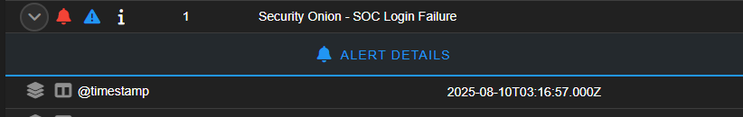

# Security Onion - SOC Login Failure

**Date/Time (ET):** 2025-08-10 03:16:57  
**Rule UUID:** bf86ef21-41e6-417b-9a05-b9ea6bf28a38  
**Severity:** High  
**Module:** Sigma  

## What Triggered
Detected failed login attempt to SOC web interface.

## Quick Triage
- Source: <fill>
- Destination: Security Onion web UI
- Could be failed admin login or brute force attempt.

## Action Taken
- Logged alert for tracking
- Confirmed no unauthorized access occurred

## Evidence

- JSON event: `alerts-2025-08-10.jsonl`
