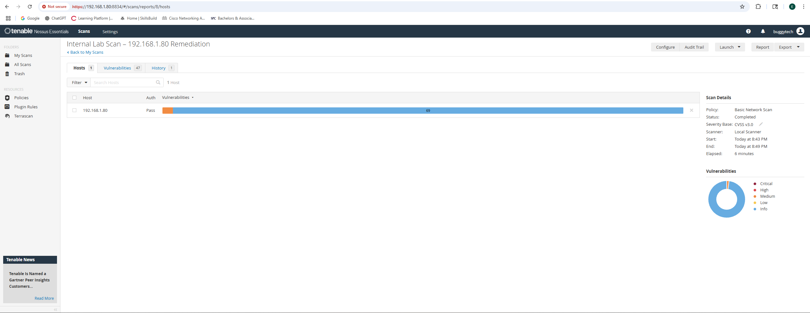

# Apache2 Remediation – After Fixes

This screenshot confirms the successful remediation of the Apache2-related findings identified during the initial scan. A new scan was performed and passed.



The following actions were taken to resolve the issues:

```bash
# 1. Apache2 Version Updated
sudo apt update
sudo apt upgrade apache2 -y

# 2. Unnecessary Modules Removed
sudo a2dismod autoindex status info
sudo systemctl restart apache2

# 3. Cleaned Default Web Root
sudo rm -rf /var/www/html/index.html

# 4. Tightened File Permissions
sudo chown -R www-data:www-data /var/www
sudo chmod -R 755 /var/www

# 5. Suppressed Server Information
# Edited /etc/apache2/conf-available/security.conf and added:
# ServerTokens Prod
# ServerSignature Off
