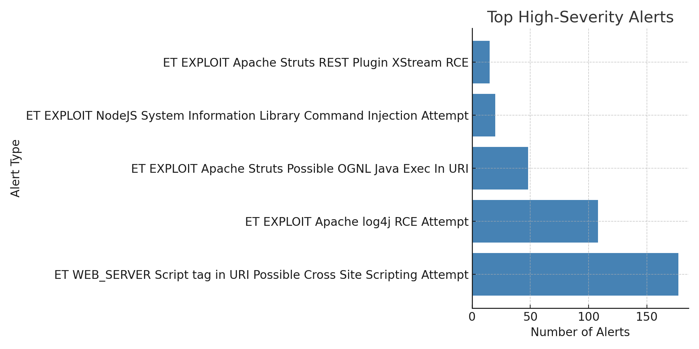

# High-Severity Alert Summary (2025-07-27)

## Overview
This summary provides insights from the **high-severity alerts** detected in the lab environment.

- **Total High-Severity Alerts:** 368
- **Top 5 Alert Types:**

| Alert Type | Count |
|------------|-------|
| ET WEB_SERVER Script tag in URI Possible Cross Site Scripting Attempt | 177 |
| ET EXPLOIT Apache log4j RCE Attempt | 108 |
| ET EXPLOIT Apache Struts Possible OGNL Java Exec In URI | 48 |
| ET EXPLOIT NodeJS System Information Library Command Injection Attempt | 20 |
| ET EXPLOIT Apache Struts REST Plugin XStream RCE | 15 |

## SOC-Style Analysis
- **Most frequent attack:** Cross-Site Scripting (XSS) attempts
- **Critical RCE vulnerabilities:** Apache log4j & Apache Struts
- **Potential exploitation targets:** Web servers & NodeJS apps
- **Recommended actions:**
  - Patch Apache log4j & Struts immediately
  - Block suspicious IPs triggering repeated XSS attempts
  - Implement WAF (Web Application Firewall) rules

